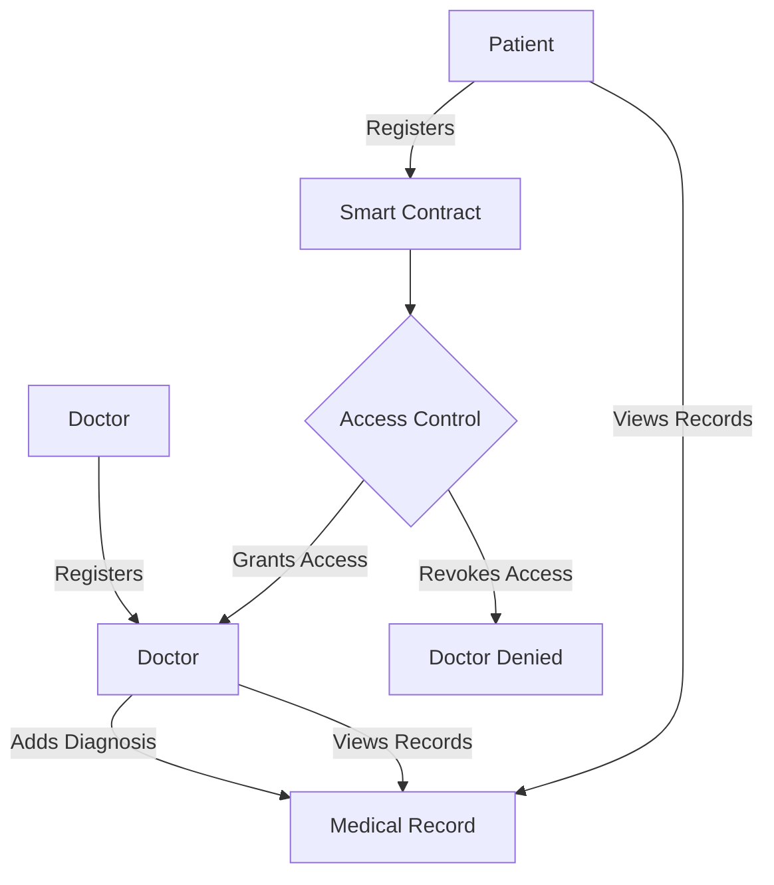
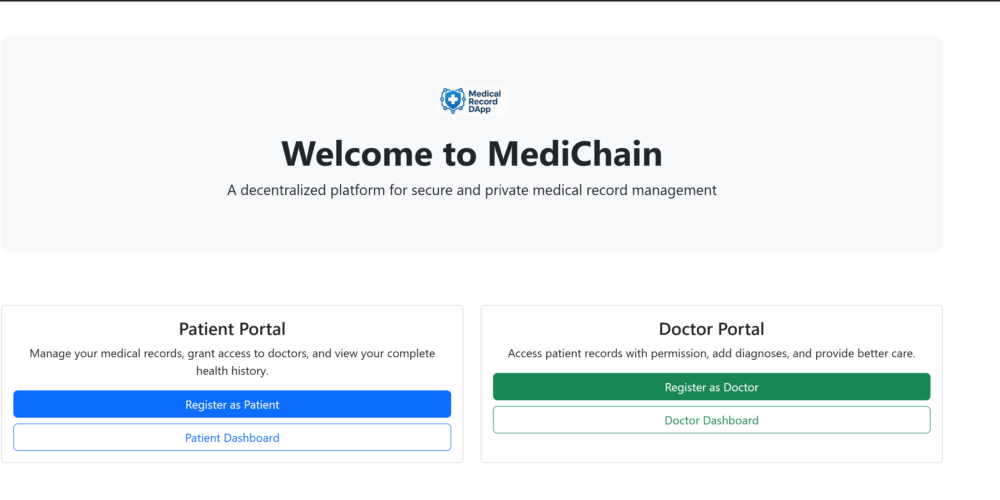

# 🏥 Medical Record DApp – Decentralized Medical Records Sharing Application

**Medical Record DApp** is a decentralized application (DApp) built on Ethereum that enables secure, transparent, and patient-controlled access to medical records. Patients manage access to their data, and doctors can view/add-record only with authorization.

---

## 📚 Table of Contents

1. [🚀 Features](#-features)  
2. [🧑‍💻 Tech Stack](#-tech-stack)  
3. [📁 Project Structure](#-project-structure)  
4. [🔄 System Flowchart](#-system-flowchart)  
5. [🔧 Setup & Installation](#-setup--installation)  
6. [📸 Screenshots (Optional)](#-screenshot)  
7. [🧩 Future Enhancements](#-future-enhancements) 

---

## 🚀 Features

- **Patient Registration**: Register as a patient using MetaMask.
- **Doctor Registration**: Doctors can sign up to access permitted data.
- **Grant/Revoke Access**: Patients control who sees their records.
- **Add Diagnosis**: Doctors securely add medical records.
- **View Records**: Patients and doctors access medical history with permission.
- **Blockchain Secured**: All actions are managed through Ethereum smart contracts.

---

## 🧑‍💻 Tech Stack

| Layer         | Technology                             |
|---------------|-----------------------------------------|
| Frontend      | React, React Router, Bootstrap          |
| Web3 Library  | [Ethers.js v6](https://docs.ethers.org/v6/) |
| Smart Contract| Solidity (Ethereum testnet)             |
| Styling       | Bootstrap 5 + Bootstrap Icons           |
| Wallet Support| MetaMask                                |

---

## 📁 Project Frontend Structure

```bash

├── components/
│   ├── RegisterPatient.js
│   ├── RegisterDoctor.js
│   ├── PatientDashboard.js
│   ├── DoctorDashboard.js
│   ├── GrantAccess.js
│   ├── RevokeAccess.js
│   ├── AddDiagnosis.js
│   ├── ViewRecords.js
│   ├── ViewPatientRecords.js
│   ├── PatientDataAccess.js
│   └── Logo.js
├── config.js           # Contract address and ABI
├── App.js              # Main application routing and logic
├── index.js
└── README.md
```

## 🔄 System Flowchart




## 🔧 Setup & Installation

✅ Prerequisites

Make sure the following are installed on your system:

Node.js (v18 or above)

npm or yarn

Hardhat (for compiling and deploying smart contracts)

MetaMask (browser extension for interacting with the DApp)

# 🧠 1. Clone the Repository
```bash
git clone https://github.com/your-username/medichain.git
cd medichain
```

### ⚙️ 2. Smart Contract Setup
#### a. Install dependencies
```bash
cd blockchain
npm install
```
#### b. Compile contracts

```bash
npx hardhat compile
```
#### c. Deploy to a local Hardhat network
```bash
npx hardhat node

#In a new terminal (with the node still running):

npx hardhat run scripts/deploy.js --network localhost

#🔁 Note the deployed contract address and copy it to use in the frontend.
```
### 🌐 3. Frontend Setup
#### a. Navigate to frontend folder
```bash
cd ../frontend
```
#### b. Install dependencies
```bash
npm install
```

### 🚀 4. Run the Frontend
```bash
npm run dev

#Your DApp should now be running at:

http://localhost:5173/

💡 If you're using Vite, it auto-refreshes on code changes.
```
### 🧪 5. Interact with the DApp
```bash
Open MetaMask and connect it to http://localhost:8545

Use the test accounts provided by Hardhat

Register as a Patient or Doctor

Grant/Revoke access

Add/view diagnoses and records
```


## 📸 Screenshot




## 🧩 Future Enhancements
🧬 IPFS integration for storing reports/files

🔐 Record-level encryption

📱 Mobile DApp version with React Native

📊 Admin analytics dashboard

